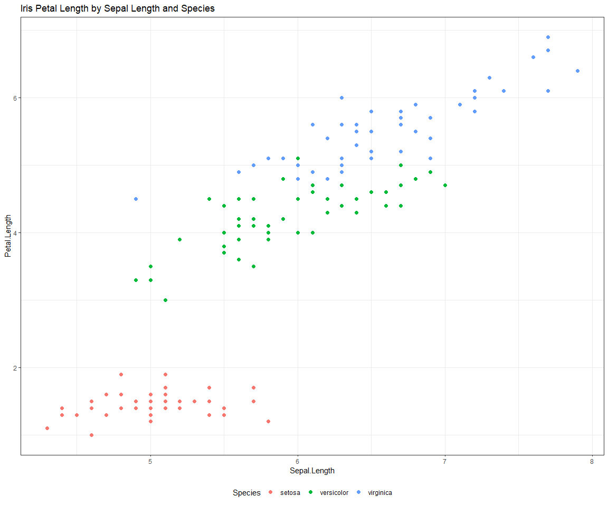

# Project Title

## Background

Include any relavant prior work and possibly one compelling chart.

## Purpose

* Why are you doing this project now?
* What are you trying to predict/measure?
* What is the default decision?

# Data Sources and Structure

Each data source requires full documentation and QA. This includes the source location and any preprocessing aggregations.

This is especially important when you recieve an Excel spreadsheet from @SoAndSo that needs to be updated regularly. (You know this happens!)

It's important to do this for EVERY data source, even if there are 20+ of them. This is your ammunition when you finish your project and go into a technical or business review. The design doc should provide you with ready answers to any questions about input data. Part of the design reviews process is to confirm business definitions and data acquisition.

## Iris {.tabset .tabset-fade .tabset-pills}

### Description

This is an example dataset provided in R that was originally collected by R.A. Fisher in 1936.

for more info type

~~~r
?iris
~~~

into the R console

This section should provide a written explanation of the data source, variables of interest, and current status (e.g. still waiting on access or data appears incomplete).

### Source

This should point the reader directly at the data source. 

Maybe it's the SQL code:

~~~sql
select * from schema.iris;
~~~

Or perhaps a location in S3

    s3://mybucket/iris
    
Or possibly an API?

    https://www.water<remove this string>qualitydata.us/data/Result/search?characteristicName=Caffeine&bBox=-92.8,44.2,-88.9,46.0&startDateLo=10-01-2006&mimeType=xlsx&zip=yes
    
*The above example came directly from the [Water Quality Portal Web Service Guide](https://www.waterqualitydata.us/webservices_documentation/#WQPWebServicesGuide)*
    
The reader should see exactly where the data came from and any transformations or aggregations that were done in preliminary data acquisition.

In this case I just call the iris data set directly in R.


```r
head(iris)
```

```
  Sepal.Length Sepal.Width Petal.Length Petal.Width Species
1          5.1         3.5          1.4         0.2  setosa
2          4.9         3.0          1.4         0.2  setosa
3          4.7         3.2          1.3         0.2  setosa
4          4.6         3.1          1.5         0.2  setosa
5          5.0         3.6          1.4         0.2  setosa
6          5.4         3.9          1.7         0.4  setosa
```

### QA + Charts

This should be your scratch pad to QA your data.

Questions this section should answer:

1. Is the data complete over the time period I need? 
2. If there are missing values, what am I going to do with them? Will I remove them? Replace with mean/median? Why?
3. Do I have adequate sample sizes over any group (e.g. factors) of interest?
4. Has the data collection process remained consistent over the entire time period? (You will likely only get this answer from a human but you may see some artifacts in your exploration.) If not, what am I going to do about it?
5. Are there any anomalies in the data? (e.g. dates that clearly can't be correct, negative values that shouldn't exist, clear scaling issues etc...)

This list is not exhaustive but a good starting point.




# Methods

Now that you know exactly what data are available, you can flesh out your modeling approach. This can be short and sweet. (e.g. All assumptions are met and necessary data available to proceed with *choose your own modeling adventure*) But let's be honest, this almost never happens right off the bat. So, this section usually looks more like a cost benefit analysis of potential methods. 

And this is why we do design reviews!

# Data Cleaning

We all know our data usually never arrives in the format we want. Yes, we've done some preliminary QA and maybe some simple aggregations but that's usually far from sufficient.

Each of the potential methods listed above may require different cleaning efforts. This is the place to start scratching at what would be required. The work here should inform the cost benefit analysis of proposed methods in the section above.

There can be some preliminary analysis and modeling taking place here.

You may also wish to sketch out plans for feature engineering. Although, I'd hold off on actually working on the engineering until you've nailed the design.

